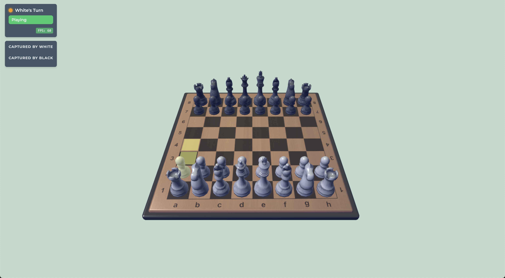

# WebGL Chess

A browser-based 3D Chess game powered by WebGL2 and JavaScript, featuring interactive piece selection, smooth animations, real-time shader effects, and a seamless UI overlay.



## Overview

WebGL Chess is a fully-featured 3D chess implementation that runs directly in the browser. It combines the classic game of chess with modern WebGL rendering techniques to create an immersive and visually appealing experience. The game features smooth animations, including piece movements, captures, and camera transitions between turns, all while maintaining a consistent 60 FPS performance.

## Features

- Fully interactive 3D Chessboard rendered with WebGL2
- Dynamic lighting with realistic shading and reflections
- Smooth camera animations that rotate around the board when turns change
- Realistic piece models loaded from OBJ files with detailed textures
- Per-piece highlighting and picking shader for intuitive selection
- Smooth movement and capture animations (jump & stomp)
- One-click piece selection with automatic deselection of previous pieces
- Responsive UI overlay with turn indicator, captured pieces list, status display, and FPS counter
- Optimized rendering pipeline maintaining consistent 60 FPS performance
- Game logic powered by modular chess rule engine
- Complete chess rules implementation including castling, en passant, and promotion

## Technologies Used

- JavaScript (ES6 Modules)
- HTML5 & CSS3
- WebGL2 for 3D rendering
- glMatrix 3.3.0 for matrix/vector math
- Custom GLSL shaders for advanced rendering effects
- Modular architecture with separation of concerns

## Performance Optimizations

- Optimized rendering pipeline with batch processing for similar objects
- Uniform location caching to reduce redundant WebGL API calls
- Matrix and vector object pooling to minimize garbage collection
- Frame rate limiting for consistent timing and smooth animations
- Reduced state changes by grouping objects by type and material
- Pre-allocated matrices and vectors to avoid memory allocation during rendering
- Conditional recalculation of matrices only when necessary

## Getting Started

### Prerequisites

- A modern web browser with WebGL2 support (Chrome, Firefox, Safari, Edge)
- A local HTTP server to serve static assets

### Installation

1. Clone the repository:
   ```
   git clone https://github.com/kolin-nielson/webGL-Chess.git
   ```
2. Navigate into the project directory:
   ```
   cd webGL-Chess
   ```

### Running the Project

1. Start a local HTTP server:
   ```
   python3 -m http.server 8000
   ```
2. Open your browser and visit:
   ```
   http://localhost:8000
   ```
3. Enjoy playing 3D Chess!

## Project Structure

```text
webGL-Chess/
├── index.html         # Main HTML entry point
├── main.js            # Main application logic and WebGL setup
├── chessSet.js        # Chess set rendering and piece management
├── chessRules.js      # Chess rules and move validation
├── mathUtils.js       # Math utilities for 3D operations
├── shader.js          # Shader program management
├── ui.js              # User interface components
└── README.md          # Project documentation
```

## Gameplay & Controls

- Click a piece to select it; valid move targets highlight on the board
- Click a highlighted square to move the selected piece
- The camera smoothly rotates to the other side when the turn changes
- The UI panel displays:
  - Current player's turn with color indicator
  - Game status (Playing, Check, Checkmate, Stalemate)
  - Captured pieces for each player
  - Real-time FPS counter

## Architecture Overview

- **Main (main.js)**: Initializes WebGL context, sets up camera, handles input events, and orchestrates the render loop
- **ChessSet (chessSet.js)**: Manages the 3D chess pieces, board rendering, and piece animations
- **Rules (chessRules.js)**: Contains chess rules, move validation, and game state evaluation
- **Math (mathUtils.js)**: Implements geometric utilities for ray picking and coordinate transformations
- **UI (ui.js)**: Manages on-screen overlays, turn/status updates, and FPS counter
- **Shaders (shader.js)**: Handles shader program compilation and management

## Future Improvements

- AI opponent integration
- Online multiplayer capabilities
- Mobile/touch support with gesture controls
- Enhanced PBR shaders and post-processing effects
- Customizable piece sets and board themes
- Game history and move notation display

## License

This project is licensed under the MIT License.